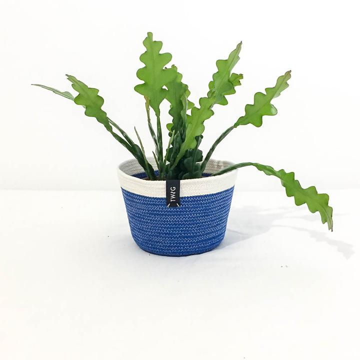
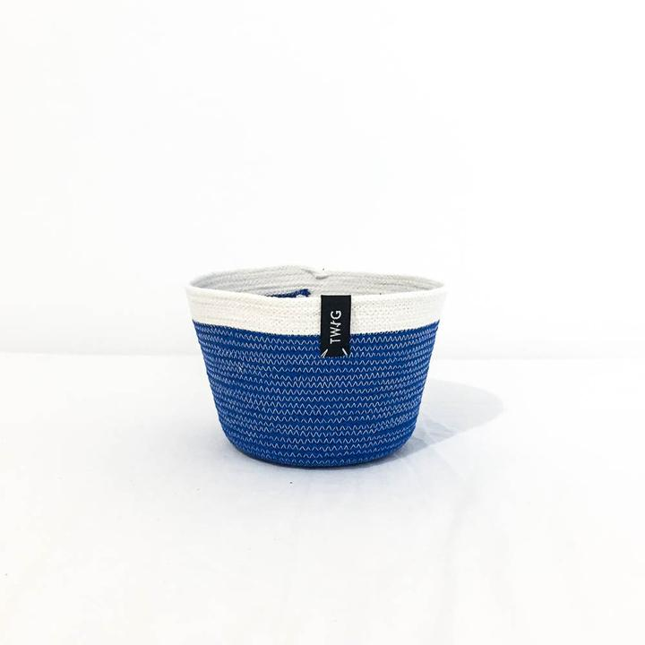
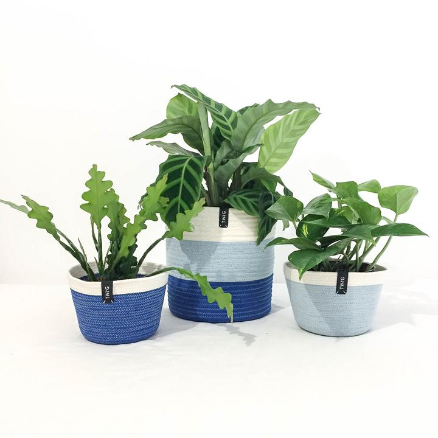
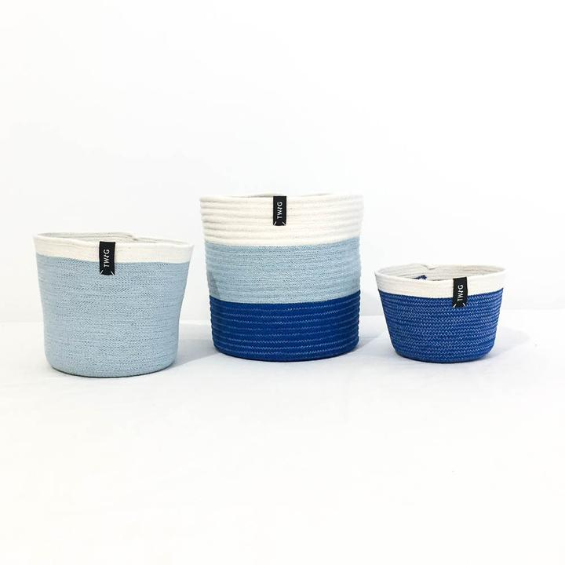

# Showcase

Showcase is a simple front-end component for displaying a bunch of images in the most optimal way for all devices. A slider on small width screens, a grid of images at biggers widths. Because why hide all your fancy images if you don't have to.

## Usage

Markup your html as follows, include the showcase.css and showcase.js and initialise

```html

<head>
  ...
  <link rel="stylesheet" href="showcase.css">
</head>
<body>
  ...
  <div id="showcase" class="showcase">
    <div class="showcase__main">
      <ul class="showcase__content" aria-label="Image slideshow. Press left or right arrow to navigate" tabindex="0">
        <li class="showcase__slide"></li>
        <li class="showcase__slide"></li>
        <li class="showcase__slide"></li>
        <li class="showcase__slide"></li>
      </ul>
      <button type="button" aria-label="previous" class="showcase__prev">
        <svg xmlns="http://www.w3.org/2000/svg" width="100%" height="100%" viewBox="0 0 443.52 443.52"><path d="M143.492 221.863L336.226 29.129c6.663-6.664 6.663-17.468 0-24.132-6.665-6.662-17.468-6.662-24.132 0l-204.8 204.8c-6.662 6.664-6.662 17.468 0 24.132l204.8 204.8c6.78 6.548 17.584 6.36 24.132-.42 6.387-6.614 6.387-17.099 0-23.712L143.492 221.863z"/></svg>
      </button>
      <button type="button" aria-label="next" class="showcase__next">
        <svg xmlns="http://www.w3.org/2000/svg" width="100%" height="100%" viewBox="0 0 443.52 443.52"><path d="M336.226 209.591l-204.8-204.8c-6.78-6.548-17.584-6.36-24.132.42-6.388 6.614-6.388 17.099 0 23.712l192.734 192.734-192.734 192.734c-6.663 6.664-6.663 17.468 0 24.132 6.665 6.663 17.468 6.663 24.132 0l204.8-204.8c6.663-6.665 6.663-17.468 0-24.132z"/></svg>
      </button>
    </div>
    <div role="tablist" class="showcase__thumbs"></div>
  </div>
  <script src="showcase.js"></script>
  <!-- Initialise showcase on an element -->
  <script>
    const showcase = new Showcase(document.getElementById('showcase'), {
      breakpoints: [740, 1200],
      thumbPosition: 'bottom'
    });
  </script>
</body>
```

## Options

**`breakpoints`** - Array(2). 2 breakpoints for mobile - tablet and tablet - desktop thresholds
**`thumbPosition`** - String('bottom' | 'right' | 'left') - Where should the thumbnails live?

## Why?

Born out of frustration with Shopify themes. While making some small changes to an existing theme, I found that the product image gallery was pulling in 2 different slideshow libraries, both dependent on jQuery of course. Chuck in different sets of markup for desktop and mobile and hundreds of lines of CSS and you've got a payload that's about 250kb - just to display some images. 

Fuck that. 

I also couldn't find a really simple slider that just works, without a crazy ton of options and customization. So I built Showcase.

## What?

Here's the manifesto:

- Provide the best UX for showcasing something on any device
- Encourage best practice through minimum options
- Accessible
- Fast & small
- Support modern browsers only (last 2 versions). No support for IE

### Minimal config

Design and UX decisions are based on user research, best practices and optimisations to converts users into customers. There are only 2 configuration options on purpose. But you can hack at it as you wish of course.

### Accessible

The demo markup includes best practices for accessibility. You can also focus on the slideshow and tap left and right arrows to navigate through it.

### Fast & Small

Performance was a key driver for this project, so I'm keeping it purposefully small and include only the bare essentials

### Modern browsers

Works in all modern browsers and web views. Nobody uses IE anymore (https://caniuse.com/usage-table). 1.42% are on IE11 and Microsoft is trying hard to get people off it. So no polyfills, no hacks, just clean code.

### Design decisions

- No slide transitions, only animating opacity. Faster, better, harder, stronger.

